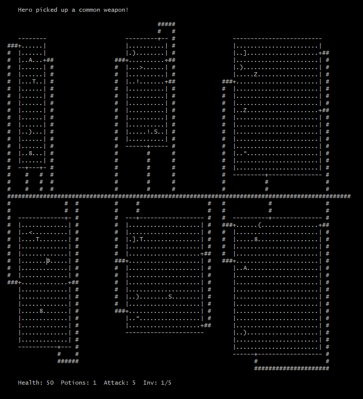

# Rogue
A first year project recreating the classic 2D dungeon crawling video game Rogue. It was written from scratch in C and relies on the ncurses library for visualizing the game directly in the terminal it was launched from. The program reads a formatted room text file (/assets/roomFile.txt) containing all of the information about the dungeon and renders the dungeon in the terminal. The hero, indicated on the map by the '@' symbol, can move around the dungeon (using WASD) picking up weapons, armour, and gold, fighting monsters, and using potions. Once the game is ended (by pressing 'q'), a summary of the hero's inventory and gold is given and the user is returned to their original terminal.

COMPILATION
---------------
In the base directory, compile with the makefile by entering the following command:

make

USAGE
---------
Run the executable with the following:

./a.out ./assets/<roomFile.txt>

Replace <roomFile.txt> with the appropriate room file in the assets folder.

ROOM FILE
------------
The format for the room file is as follows:
- There are 6 lines, each line pertaining to one room starting from the top left and working right then down.
- The dimensions of the room are indicated at the beginning of each line (ROWS X COLS).
- Doors are defined next. They begin with a d then are followed by one of n/s/e/w and a number, indicating where on the north/south/east/west wall that the door is located for that room. Doors are used to connect the different rooms, using hallways (automatically generated based on the door locations).
- Then all monsters, items, and the initial hero starting positions are defined. The format is the corresponding letter followed by coordinates that are relative to the top left of the room.

TESTING
-----------
Program has been tested for the following cases:
- Passing of existing and non-existent files while running the executable
- Properly formatted room file
- 6 rooms, each room size <= 18X23
- Use of potions, full inventory, combat, etc
- Several doors on each wall and corresponding hallways
- Several small/large monsters in each room
- Blocking monsters on their patrol

KNOWN LIMITATIONS
---------------------
- Non-existent file names passed in for reading
- Reading in lines longer than 150 characters from the room file
- Assumes room file is perfectly formatted
- Assumes room file follows specifications perfectly
- Ncurses causes valgrind to detect memory leaks. No leaks were found when the ncurses code was commented out in main.c
- The game is programmed such that only the hero can initiate combat
- In the event that a monster is blocked, it will continue the next move in its patrol on the next turn (not really a 
limitation but it may look odd)
